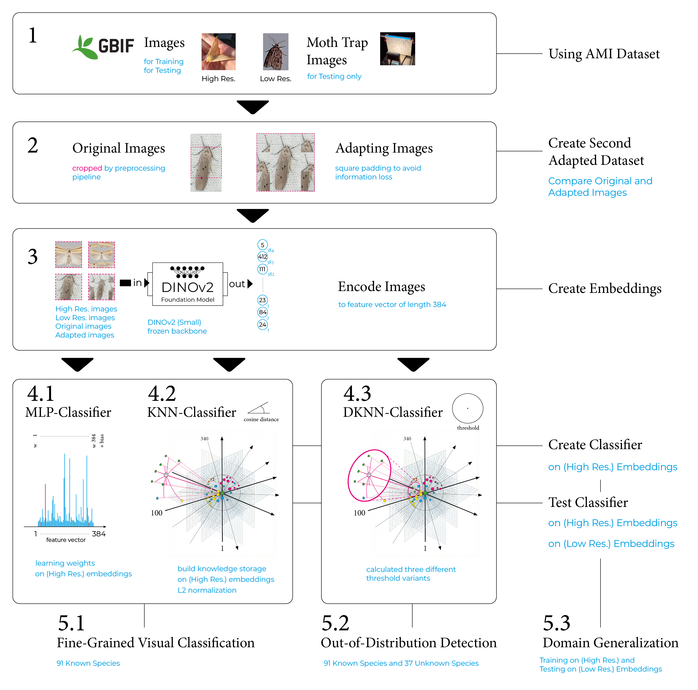

# Master-Thesis: Adapting DINOv2 Embeddings for Fine-Grained Species Classification and Novelty Detection in Automated Moth Monitoring

**Autor:** Johannes Leick <br>
**Institution:** [Explainable Artificial Intelligence (xAI)](https://www.uni-bamberg.de/en/ai/chair-of-explainable-machine-learning/) at Otto Friedrich University of Bamberg <br>

**Thesis:** [pdf](./masterThesis_v2.pdf) <br>
**Presentation slides:** [pdf](./presentation(20min).pdf) <br>

This thesis investigates the use of modern computer vision methods for automated moth monitoring in biodiversity research. Using self-supervised image embeddings extracted from the DINOv2 foundation model, the study evaluates approaches for fine-grained species classification, domain generalization, and novelty detection on the AMI dataset.

Several classifiers, including Multilayer Perceptron (MLP), K-Nearest Neighbor (KNN), and Deep K-Nearest Neighbor (DKNN), are evaluated across high-resolution GBIF imagery and low-resolution trap images representing real-world monitoring conditions.

Results show that the learned representations enable highly accurate fine-grained classification of 91 moth species on high-resolution images, achieving over 94% Balanced Accuracy. However, performance drops significantly under domain shift when models are applied to low-resolution trap imagery. Novelty detection experiments distinguishing 91 known species from 37 unseen species achieve moderate performance (AUROC of 0.65) on high-resolution data but degrade to near-chance levels under domain shift.

Additionally, a padded square dataset was introduced to reduce information loss during image encoding, showing degradation across all classifiers for high-resolution images, whereas a slight
improvement was observed for low-resolution images.

The results indicate that while DINOv2 embeddings effectively capture fine morphological differences in high-resolution latent space, maintaining class separability under low-resolution real-world images (domain shifts) remains a significant challenge.


*The diagram illustrates the different methodological steps of the master Thesis: (1) The AMI dataset used comprises high-resolution images from the GBIF platform and low-resolution images from moth traps. (2) To prevent information loss due to cropping in the preprocessing pipeline of DINOv2, a second adapted dataset was created using square padding. (3) The embeddings are generated using the DINOv2 Small foundation model, which encodes the images into feature vectors of length 384. Three models built upon these embeddings are presented in detail: (4.1) The MLP (Multi-Layer Perceptron) learns to weight the various features of the embeddings differently for fine-grained classification. (4.2) In the KNN (K-Nearest Neighbor) method, the embeddings are considered as a whole and stored in a knowledge storage. This is visualized as a high-dimensional coordinate system in which the embeddings have been normalized using the L2 norm. (4.3) The DKNN (Deep KNN) method builds upon the KNN classifier and supplements it with a threshold. This threshold determines the density around a target sample and thus decides whether it is classified as a known or unknown sample. (5.1) The MLP and KNN classifiers were evaluated for Fine-Grained Visual Classification (FGVC) of 91 species. (5.2) The DKNN method was used for Novelty Detection (Out-of-Distribution; distinguishing between 91 known and 37 unknown species). (5.3) While high-resolution images were used for development and initial testing, all methods were additionally evaluated for their domain generalization capabilities. For this purpose, low-resolution test datasets from moth traps were used to assess robustness against domain shift.*

### Quick start
1. Clone repository:
   ```bash
   git clone https://github.com/Johannesproximo/masterThesis.git
   ```
3. Set up conda environment: <br>
   If you do not have Conda installed, we recommend [installing Miniconda](https://www.anaconda.com/docs/getting-started/miniconda/install).
   
   ```bash
   conda env create -f environment.yml
   ```
5. Activate environment:
   ```bash
   conda activate masterThesis
   ```
7. Adapt the paths in the Jupyter notebooks located in:

   `code/...`

   For example, start with the notebook for image downloads:

   `code/00_download_image_high/fine_grain/0_download_images.ipynb`

8. Run Jupyter notebooks

### Dependencies
The environment is based on **Python 3.12** and includes the following core libraries  
(managed via `environment.yml`):
- **Data Science:** pandas, scikit-learn, seaborn, opencv  
- **Deep Learning:** pytorch, timm  
- **Specialized:** python-dwca-reader, webdataset, nbconvert, conda-forge::lz4

### Repository Structure
| File / Folder        | Description                                                                 |
|----------------------|------------------------------------------------------------------------------|
| `code/` | Contains the Jupyter notebooks developed for the implementation of this thesis. |
| `data/`              | Contains CSV datasets from the original AMI dataset, including the documented download status of each sample, as well as datasets created for this thesis. |
| `models/`            | Contains all created classifiers (models) and visualisations. |
| `results/`            | Contains all classification results and visualisations. |
| `environment.yml`    | Configuration file for the Conda environment. |
| `masterThesis_v2.pdf`    | Contains the second version of the master’s thesis with formatting corrections. |
| `presentation(20min).pdf`    | Contains final presentation of the master’s thesis. |
